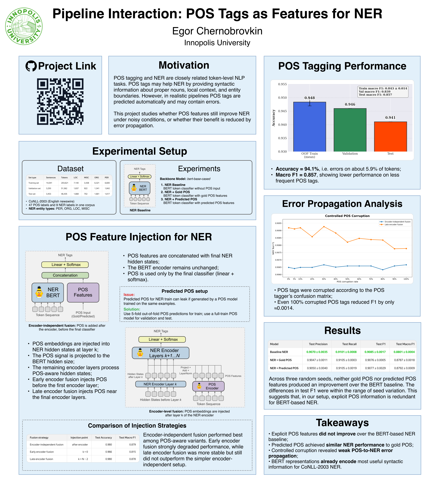

# Pipeline Interaction: POS Tags as Features for NER

<p align="center">
  
  
  
  
  
</p>

<p align="center">
  <b>Do POS tags still help NER when the backbone is already BERT?</b>
</p>

<p align="center">
  
</p>

This project studies whether explicit POS-tag information helps BERT-based Named Entity Recognition on CoNLL-2003.

We compare a standard BERT NER baseline with several POS-aware NER variants. POS tags are injected either after the encoder, before the final classifier, or inside the encoder. We also test whether POS tagging errors propagate into NER by corrupting POS tags with a realistic error distribution based on a POS tagger confusion matrix.

## Main Question

Can POS tags improve BERT-based NER, and do POS tagging errors meaningfully affect NER predictions?

## Repository Structure

```text
artifacts/
  dataset/
    conll2003/                  # Local CoNLL-2003 dataset files
  model/
    bert-base-cased/            # Local BERT tokenizer/config files

notebooks/
  01_results_analysis.ipynb     # Main notebook for analyzing saved JSON results

scripts/
  01_generate_pos_oof.py
  02_train_ner_baseline.py
  03_train_ner_pos_encoder_independent.py
  04_train_ner_pos_encoder_level.py
  05_controlled_pos_corruption.py

src/
  constants.py                  # Shared constants
  data.py                       # Dataset loading helpers
  tokenization.py               # Tokenization and label/POS alignment
  collators.py                  # Custom data collators
  models.py                     # POS-aware NER models
  metrics.py                    # NER/POS metrics
  evaluation.py                 # Evaluation helpers
  pos_corruption.py             # POS corruption utilities
  train_manual.py               # Manual PyTorch training loop helpers
  seed.py                       # Seeding utilities

results/
  metrics/
    ner_baseline.json
    ner_gold_pos.json
    ner_predicted_pos.json
  pos/
    confusion_matrix.json
  pos_corruption/
    early_fusion.json
    late_fusion.json

figures/                        # Generated plots
poster/                         # Final poster files
requirements.txt
README.md
```

## Environment Setup

### 1. Clone the repository

```bash
git clone https://github.com/<your-username>/nlp-case-study.git
cd nlp-case-study
```

### 2. Download the dataset and backbone model

The scripts expect the CoNLL-2003 dataset and BERT model files to be available under artifacts/:

```bash
artifacts/
  dataset/
    conll2003/
  model/
    bert-base-cased/
```

You can either place the files manually into these folders or download them with Hugging Face tools.

**Example:**

```python
from datasets import load_dataset
from transformers import AutoTokenizer, AutoConfig
dataset = load_dataset("lhoestq/conll2003")
dataset.save_to_disk("artifacts/dataset/conll2003")
tokenizer = AutoTokenizer.from_pretrained("bert-base-cased")
config = AutoConfig.from_pretrained("bert-base-cased")
tokenizer.save_pretrained("artifacts/model/bert-base-cased")
config.save_pretrained("artifacts/model/bert-base-cased")
```

If you use a different local path, update the script arguments accordingly, for example:

```bash
--dataset_name artifacts/dataset/conll2003
--model_name artifacts/model/bert-base-cased
```

### 3. Create a fresh environment and install dependencies

**Using Conda Env:**

```bash
conda create -n nlp-case-study python=3.10 -y
conda activate nlp-case-study
pip install --upgrade pip
pip install -r requirements.txt
```

**To check that the environment works:**

```bash
python -c "import torch, transformers, datasets; print('Environment is ready')"
```

## Running Experiments

Run all commands from the project root:
```bash
cd /Users/chrnegor/Documents/study/nlp-case-study
```

**scripts/01_generate_pos_oof.py**

This script trains the POS tagger used to generate predicted POS features for the NER experiments.
It uses k-fold out-of-fold prediction on the training split to avoid leakage: each training example receives POS predictions from a model that was not trained on that example. The script also trains a final POS tagger on the full training set and uses it to predict POS tags and POS logits for the validation and test splits.

Example:

```bash
python scripts/01_generate_pos_oof.py \
  --model_name artifacts/model/bert-base-cased \
  --dataset_name artifacts/dataset/conll2003 \
  --output_dir ./case_study_outputs/pos_oof \
  --num_folds 5 \
  --num_train_epochs 3 \
  --train_batch_size 16 \
  --eval_batch_size 16 \
  --fp16
```

**scripts/02_train_ner_baseline.py**

This script trains the baseline BERT-based NER model without any POS features.
It runs training for several random seeds, evaluates the model on the validation and test splits, saves the best checkpoint, and writes aggregated mean/std metrics.

Example:

```bash
python scripts/02_train_ner_baseline.py \
  --model_name artifacts/model/bert-base-cased \
  --dataset_name artifacts/dataset/conll2003 \
  --output_dir ./case_study_outputs/ner_baseline \
  --seeds 42 43 44 \
  --num_train_epochs 3 \
  --train_batch_size 16 \
  --eval_batch_size 16 \
  --eval_steps 100 \
  --fp16
```

**scripts/03_train_ner_pos_encoder_independent.py**

This script trains the POS-aware NER model with encoder-independent fusion.
In this setup, BERT first produces contextual token representations, and POS features are added only before the final NER classifier. The POS input can come from gold POS tags or from predicted POS tags. The script supports several POS representations: one-hot vectors, POS logits, and trainable POS embeddings.

Example:

```bash
python scripts/03_train_ner_pos_encoder_independent.py \
  --model_name artifacts/model/bert-base-cased \
  --dataset_name artifacts/dataset/conll2003 \
  --predicted_pos_dataset_path /root/case_study_outputs/dataset_with_predicted_pos \
  --output_dir ./nlp_case_study_outputs/ner_with_predicted_pos_embd \
  --pos_source gold \
  --pos_feature_type trainable_embed \
  --pos_embed_dim 32 \
  --seeds 42 43 44 \
  --num_train_epochs 3 \
  --train_batch_size 16 \
  --eval_batch_size 16
```

**scripts/04_train_ner_pos_encoder_level.py**

This script trains the NER model with encoder-level POS fusion.
Instead of adding POS only before the classifier, this experiment injects trainable POS embeddings into the hidden states of the BERT encoder. The injection point can be controlled with --inject_layer_offset_from_end. For example, 2 injects POS before the last two encoder layers. This tests whether deeper POS integration makes the NER model use POS information more effectively.

Example:

```bash
python scripts/04_train_ner_pos_encoder_level.py \
  --model_nameartifacts/model/bert-base-cased \
  --dataset_name artifacts/dataset/conll2003 \
  --predicted_pos_dataset_path /root/case_study_outputs/dataset_with_predicted_pos \
  --output_dir ./nlp_case_study_outputs/ner_with_mid_pos_injection \
  --pos_source gold \
  --pos_embed_dim 32 \
  --inject_layer_offset_from_end 2 \
  --seeds 42 43 44 \
  --num_train_epochs 3 \
  --train_batch_size 16 \
  --eval_batch_size 16
```

**scripts/05_controlled_pos_corruption.py**

This script runs the controlled POS corruption experiment.
It loads a trained POS-aware NER checkpoint and a POS confusion matrix. Then it corrupts gold POS tags on the test set at different corruption rates. The replacement POS tags are sampled from the real error distribution of the POS tagger, rather than uniformly at random. This makes the corruption more realistic and lets us measure whether POS errors propagate into NER predictions.

Example:

```bash
python scripts/05_controlled_pos_corruption.py \
  --ner_model_dir artifacts/model/ner_gold_pos_ckpt/best_checkpoint \
  --pos_confusion_dir artifacts/model/pos_model/best_checkpoint \
  --dataset_name /root/nlp-case-study/artifacts/dataset/conll2003 \
  --fusion_type encoder_level \
  --pos_feature_type trainable_embed \
  --pos_embed_dim 32 \
  --inject_layer_offset_from_end 2 \
  --batch_size 16 \
  --corruption_rates 0.0 0.1 0.2 0.3 0.4 0.5 0.6 0.7 0.8 0.9 1.0
```